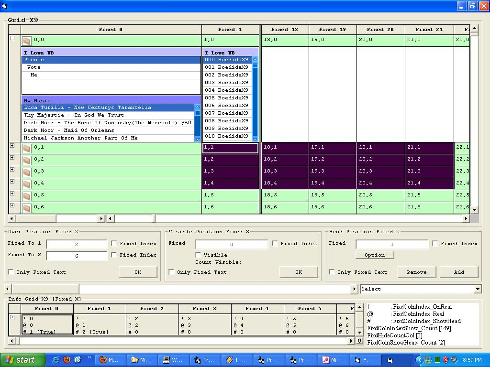



## Grid\-X9 \(\*\.OCX\)

### Description

[Update]

*. Fixed Column Grid Moving Position

*. Fixed Column Visible

*. Fixed Column Head

----

*. List On Sub Cell

*. Background Gradient Grid

*. Picture Icon Grid

*. Many List On Sub Cell

*. Format Show List (* PicThumb)

this program not full complete 100% but i want share my program.
 
### More Info
 

             |
---                |---
**Submitted On**   |2009-08-05 21:00:52
**By**             |[BoedidaX9](https://github.com/Planet-Source-Code/PSCIndex/blob/master/ByAuthor/boedidax9.md)
**Level**          |Intermediate
**User Rating**    |5.0 (10 globes from 2 users)
**Compatibility**  |VB 5\.0, VB 6\.0
**Category**       |[Custom Controls/ Forms/  Menus](https://github.com/Planet-Source-Code/PSCIndex/blob/master/ByCategory/custom-controls-forms-menus__1-4.md)
**World**          |[Visual Basic](https://github.com/Planet-Source-Code/PSCIndex/blob/master/ByWorld/visual-basic.md)
**Archive File**   |[Grid\-X9\_\(\_2159668102009\.zip](https://github.com/Planet-Source-Code/boedidax9-grid-x9-ocx__1-68988/archive/master.zip)

